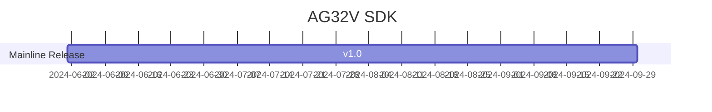

# [AG32VF407](https://github.com/SoCXin/AG32VF407)

* [agmsemi](http://www.agm-micro.com/): [RISC-V(RV32IMAFC)](https://github.com/SoCXin/RISC-V)
* [L3R3](https://github.com/SoCXin/Level): 248->384MHz (630->976CoreMark), [￥13.8 (LQFP-64)](https://item.taobao.com/item.htm?id=849278172829&spm=a21xtw.29178619.product_shelf.6.7f5f5c92B5bpUJ&skuId=5636369132825)

## [简介](https://github.com/SoCXin/AG32VF407/wiki)

[AG32VF407](http://www.agmsemi.com/program_details_5445481.html) 

### 关键特性

* 248 MHz RISC-V (RV32IMAFC)
* 128KB SRAM + 512KB/1MB Flash
* 3x12-bit 1Msps ADC (3Msps in triple interleaved mode)
* 2x10-bit 1Msps DAC
* AGRV2K CPLD
* 1 x CAN2.0
* 5 x UART
* 2 x I2C
* 2 x Basic Timer
* 5 x Advanced Timer
* Support SDIO, Ethernet MAC
* Support USB FS+OTG
* 3 x 12 bit, up to 3M SPS ADCs(17 channels), 2 DACs
* 2 x Comparator
* RTC
* SPI

AG32VH407RCT6内置8MB pSRAM，最高访问速度 200MB/S，目前公开的合封pSRAM的只有64封装；

## [资源收录](https://github.com/SoCXin)

* [参考资源](src/)
* [参考文档](docs/)
* [参考工程](project/)

## [选型建议](https://github.com/SoCXin)

[AG32VF407](https://github.com/SoCXin/AG32VF407) 是该系列最高配置型号，其下还包括AG32VF303、AG32VF207、AG32VF103等型号，直接PIN TO PIN兼容友商STM32Fxxx。RISC-V开源内核，248Mhz的超高主频，是STM32F207/407望尘莫及的。

* 型号间主要差异在MCU主频和存储配置上，外设差异在SDIO，Ethernet MAC；
* 全系都配置[AGRV 2K CPLD](http://www.tcx-micro.com/doc_26934765_5589867_0_1.html)，相当于4片ALTERA CPLD EPM570的容量；

### 开发环境

* 1：MCU部分使用VScode搭建开发环境（我们提供所有安装包）；
* 2：CPLD/FPGA使用Quartus开发（兼容Altera，代码可以直接参考Quartus所编写的Verilog语言），开发好通过Supra工具综合转换。
* 使用jlink V9及以上版本，通过zadig-2.8更换驱动；
* AGM BLASTER 、CMSIS-DAP下载；
